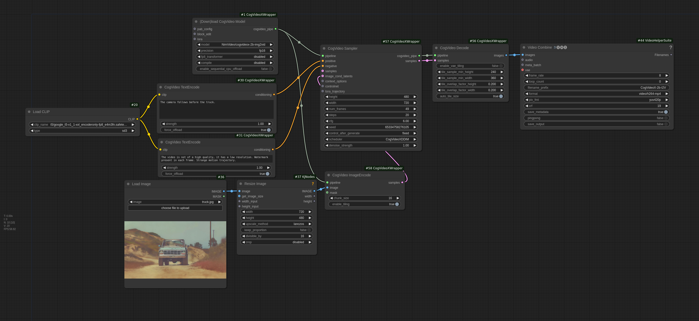

# cogvideox-2b-img2vid


https://github.com/user-attachments/assets/925e733c-cab6-4b09-ad92-f3b8324679c9

### ComfyUI Example
<p>
    
</p>
<p>
    <a href="resources/cogvideox-2b-img2vid-workflow.json">JSON Workflow Example</a>
</p>
ComfyUI custom node can be found <a href="https://github.com/Nim-Video/ComfyUI-CogVideoXWrapper">here</a>.

## Setup and Inference Instructions

### Prerequisites

1. **System Update and Dependencies Installation**
   ```bash
   sudo apt-get update
   sudo apt-get install git-lfs cbm ffmpeg
   ```

2. **Create and Activate Conda Environment**
   ```bash
   conda create --name py310 python=3.10
   conda activate py310
   pip install ipykernel
   python -m ipykernel install --user --name py310 --display-name "py310"
   ```

Clone repo 
```bash
git clone https://github.com/Nim-Video/cogvideox-2b-img2vid.git
cd cogvideox-2b-img2vid
```
  
Create venv  
```bash
python -m venv venv
source venv/bin/activate
```
  
Install requirements
```bash
pip install -r requirements.txt
```
  
### Simple examples
#### Inference with cli
```bash
python -m inference.cli_demo \
    --video_path "resources/truck.jpg" \
    --prompt "A truck is driving through a dirt road, showcasing its capability for off-roading." \
    --model_path NimVideo/cogvideox-2b-img2vid
```

#### Inference with Gradio
```bash
python -m inference.gradio_web_demo \
    --model_path NimVideo/cogvideox-2b-img2vid
```

## Acknowledgements
Original code and models [CogVideoX](https://github.com/THUDM/CogVideo/tree/main).  
